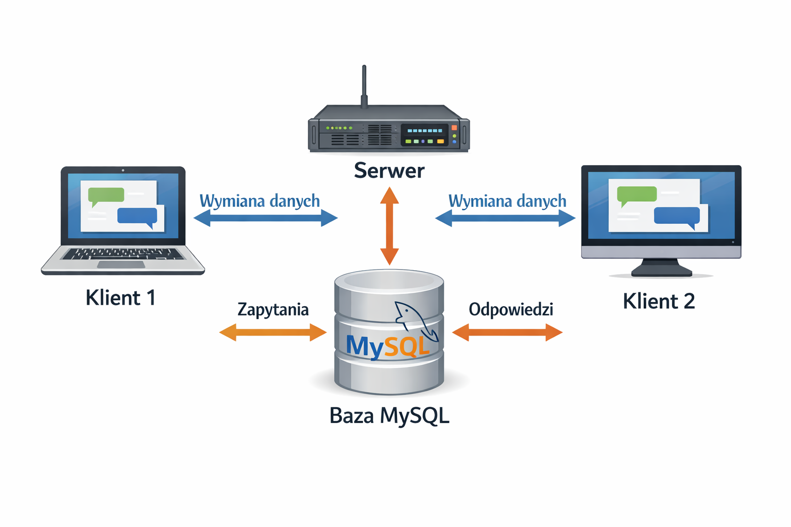

# CzatuCzatu - System Komunikacji Lokalnej

  

## 1. Informacje ogólne

**CzatuCzatu** to nowoczesna aplikacja desktopowa typu komunikator, stworzona w technologii .NET 8 WPF. Projekt został zaprojektowany z myślą o szybkiej i bezpiecznej wymianie informacji w obrębie sieci lokalnej (LAN), co czyni go rozwiązaniem niezależnym od zewnętrznych serwerów chmurowych i dostępu do Internetu.

## 2. Wymagania funkcjonalne

**Zarządzanie tożsamością**: Tworzenie konta oraz autoryzacja dostępu przez system logowania.

**Komunikacja tekstowa**: Wysyłanie i odbieranie wiadomości w czasie rzeczywistym.

**Transfer plików**: Możliwość przesyłania załączników bezpośrednio przez okno czatu.

**Maksymalny rozmiar pliku**: 16 MB (ograniczenie wynikające z typu danych MEDIUMBLOB w bazie MySQL).

**Powiadomienia**: Sygnalizacja dźwiękowa o nadejściu nowej wiadomości.

**Archiwizacja**: Pełna historia rozmów i przesłanych plików dostępna po zalogowaniu.

**Praca w tle**: Możliwość zminimalizowania aplikacji do zasobnika systemowego (System Tray).

## 3. Wymagania niefunkcjonalne

**Technologia i Platforma**: System zbudowany w oparciu o najnowszy framework **.NET 8** oraz bibliotekę **WPF**, co zapewnia wysoką wydajność na systemach Windows.

**Bezpieczeństwo (Security)**: Hasła użytkowników nie są przechowywane w formie jawnej. Zastosowano zaawansowane haszowanie algorytmem **BCrypt.Net-Next**, co chroni dane przed nieautoryzowanym dostępem.

**Wydajność (Performance)**: Wykorzystanie programowania asynchronicznego (**async/await**). Dzięki temu operacje sieciowe i bazodanowe (np. pobieranie dużych plików) nie blokują interfejsu użytkownika.

**Równoległość (Parallelism)**: Architektura bazy danych (MySQL w XAMPP) została skonfigurowana do obsługi wielu jednoczesnych połączeń od różnych klientów w sieci lokalnej.

**Integracja zasobów**: Wszystkie kluczowe komponenty (ikony, dźwięki) są wkompilowane w plik wykonywalny jako Resources, co eliminuje ryzyko błędów przy braku zewnętrznych plików.

## 4. Przypadki użycia

**Rejestracja i Autoryzacja**: Użytkownik przesyła dane formularza -> System weryfikuje unikalność loginu -> Hasło jest haszowane (BCrypt) i zapisywane w bazie -> Użytkownik otrzymuje dostęp do czatu.

**Wymiana wiadomości**: Użytkownik wprowadza tekst -> System zapisuje rekord w tabeli z kluczem obcym nadawcy -> Wiadomość jest natychmiastowo wyświetlana u wszystkich zalogowanych uczestników.

**Transfer plików**: Użytkownik wybiera plik (max 16 MB) -> Dane binarne są konwertowane i zapisywane w bazie -> Inni użytkownicy otrzymują możliwość pobrania załącznika na swój dysk.

## 5. Architektura systemu

Projekt został oparty na klasycznej architekturze **Klient-Serwer** w sieci lokalnej. Taki model pozwala na centralizację danych oraz zapewnia spójność komunikacji między wieloma użytkownikami jednocześnie.

  

**Warstwa Klienta (Aplikacja WPF)**: Każdy użytkownik uruchamia własną instancję aplikacji klienckiej, która odpowiada za interfejs graficzny oraz przesyłanie żądań do serwera.

**Warstwa Serwera (XAMPP / MySQL)**: Centralny węzeł systemu, który zarządza bazą danych. Przyjmuje zapytania od klientów, przetwarza je i odsyła odpowiedzi (np. nowe wiadomości lub pliki).

**Komunikacja**: Wymiana danych odbywa się w czasie rzeczywistym z wykorzystaniem protokołu TCP/IP na porcie 3306.

## 6. Stos technologiczny

Wybór technologii został podyktowany chęcią zapewnienia wysokiej wydajności, bezpieczeństwa danych oraz nowoczesnych standardów programowania desktopowego:

**Język programowania**: C# (v12) – główny język logiki biznesowej aplikacji.
 
**Framework**: .NET 8.0 (WPF) – nowoczesna platforma do tworzenia wydajnych aplikacji desktopowych dla systemu Windows, oferująca bogate możliwości tworzenia interfejsu użytkownika.
 
**Baza danych**: MySQL (hostowana w środowisku XAMPP) – relacyjna baza danych zapewniająca centralne i bezpieczne składowanie informacji o użytkownikach i wiadomościach.

**Główne biblioteki (NuGet Packages)**

    - MySqlConnector- Zapewnia stabilne, wydajne i asynchroniczne połączenie z bazą danych MySQL.
    
    - BCrypt.Net-Next- Wykorzystywana do implementacji mechanizmów bezpieczeństwa poprzez jednostronne haszowanie haseł użytkowników.
    
    - CommunityToolkit.Mvvm- Narzędzie wspierające implementację wzorca architektonicznego MVVM, co zapewnia czystość kodu        i separację logiki od widoku.

 ## 7. Struktura folderów
    
Aplikacja została zorganizowana zgodnie z profesjonalnymi standardami projektowymi dla platformy .NET, co zapewnia przejrzystość kodu i ułatwia jego rozwój:

CzatuCzatu/

├── Models/           # Klasy reprezentujące struktury danych (użytkownik, wiadomość, plik)

├── ViewModels/       # Logika biznesowa i powiązania danych z interfejsem (MVVM)

├── Views/            # Definicje interfejsu użytkownika w języku XAML

├── Services/         # Serwisy odpowiedzialne za komunikację z bazą danych

├── Assets/           # Zasoby wkompilowane w plik EXE (logo, ikony, dźwięki)

├──CzatuCzatu.csproj  # Główny plik konfiguracji projektu i zależności NuGet

├──App.xaml          # Definicje globalnych stylów i zasobów wizualnych (XAML)

├──App.xaml.cs       # Logika startowa, zarządzanie cyklem życia i procesami (C#)

└── czatu_czatu_db.sql # Skrypt inicjalizujący strukturę bazy danych MySQL

## 8. Proces uruchomienia projektu

   #  Konfiguracja lokalna (Zalecana)

Jest to najprostszy sposób uruchomienia projektu na jednej maszynie w celu weryfikacji funkcjonalności:

1. **Przygotowanie Bazy Danych**:
   
    * Uruchom panel **XAMPP** i wystartuj moduł **MySQL**.
      
    * Otwórz narzędzie **phpMyAdmin** i utwórz nową bazę danych o nazwie `czatu_czatu_db`.
      
    * Zaimportuj do niej plik `czatu_czatu_db.sql` (dostępny w głównym katalogu repozytorium).
      
3. **Uruchomienie Aplikacji**:
   
    * Otwórz rozwiązanie `CzatuCzatu.sln` w programie **Visual Studio 2022**.
      
    * W klasie `DatabaseService.cs` upewnij się, że parametr `Server` w Connection String to `localhost` lub `127.0.0.1`.
      
    * Skompiluj i uruchom projekt przyciskiem **F5**.
      
    * Dla lepszego przetestowania aplikacji otwórz równocześnie dwa okna aplikacji do zasymulowania prawdziwej rozmowy.

  # Konfiguracja w sieci lokalnej (LAN) (opcjonalnie)

Aplikacja została w pełni przystosowana do pracy na dwóch osobnych urządzeniach w jednej sieci Wi-Fi/Ethernet. Aby to osiągnąć, wykonaj poniższe kroki:

1. **Konfiguracja Serwera (Komputer z bazą)**:
   
   **MySQL Access**: W pliku konfiguracyjnym `my.ini` zakomentuj linię `bind-address="127.0.0.1"` (dodaj `#` na początku), aby serwer akceptował połączenia zewnętrzne.
      
   **Uprawnienia**: W zakładce "Konta użytkowników" w phpMyAdmin nadaj użytkownikowi `root` uprawnienia dla hosta `%` (Any Host).
      
   **Zapora (Firewall)**: Dodaj regułę przychodzącą dla portu **TCP 3306**. W ustawieniach "Zakres" ustaw "Dowolny lokalny adres IP", a jako "Zdalny adres IP" podaj adres IP drugiego laptopa, aby umożliwić mu dostęp.(Pamiętaj aby usunąć tą regułę zaraz po testach!!!)
   
3. **Konfiguracja Klienta (Drugi laptop)**:
    * **Adresacja IP**: Wprowadź adres IPv4 lokalnego serwera (komputer z bazą) w kodzie aplikacji  w pliku `DatabaseService.cs` zamiast `localhost`na obu urządzeniach.
    * **Profil Sieci**: Ustaw profil sieciowy na **Prywatny** na obu urządzeniach. Zapobiegnie to blokowaniu pakietów ICMP (Ping) oraz błędowi "Connect Timeout expired".

      **PROSZE O PRZETESTOWANIE NASZEJ APLIKACJI I PODZIELENIE SIE PRZEMYSLENIAMI W CELU DALSZYCH USPRAWNIEŃ**

